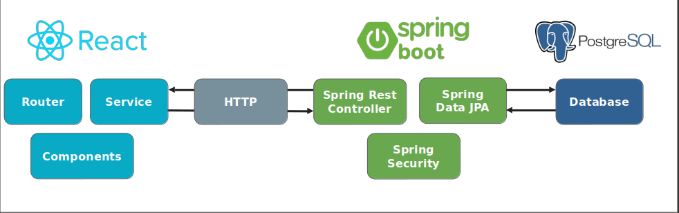
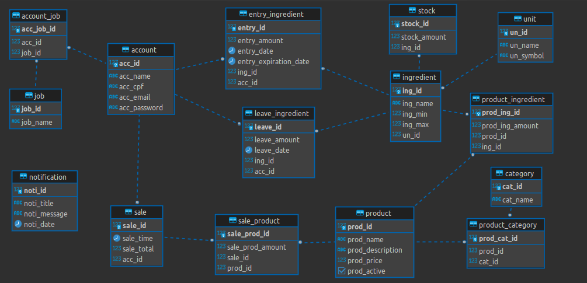
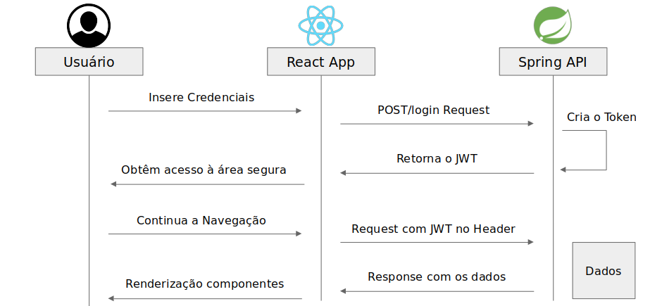
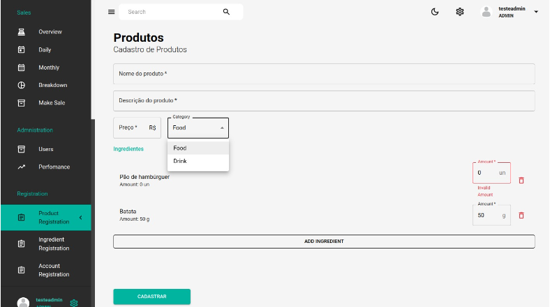

# btc.web

Btcweb trata-se de uma aplicação web destinada para realizar controle de movimentações de estoque e vendas de um pequeno estabelecimento de bar.

Além do armazenamento de ingredientes e seu estoque, o sistema armazena informações de produtos, funcionários, vendas e historico de movimentações.

A aplicação implementa uma autenticação JWT, e possui diversos níveis de autorização.

## ⚙️Tecnologias utilizadas:

- [Node v18.16.0:](https://nodejs.org/en/download)

- [Java 17](https://www.oracle.com/java/technologies/javase/jdk17-archive-downloads.html)

- [Docker](https://docs.docker.com/get-docker/)

- [Postgresql](https://www.postgresql.org/)

- [Spring Boot](https://spring.io/projects/spring-boot/)

- [React](https://react.dev/)

- [MaterialUI](https://mui.com/)

## Overview:

O projeto trata-se de:

- Banco de dados PostgreSQL

- Aplicação springboot que realiza a comunicação com o banco de dados Postgresql e sobe uma API REST que recebe requisições do cliente.

- Cliente React que realiza requisições para a API, recebe as respostas e trata os dados, facilitando o manuseio do app por meio de uma interface dinâmica.

## Diagrama ER

Diagrama referente ao banco de dados da aplicação.

## Autenticação:

A Autenticação é feita utilizando tokens JWT e o Spring Security, conseguindo garantir a autenticidade do cliente de maneira segura, eficaz e simples. 

## 🛠️ Exemplo - Tela de Cadastros de produtos
Aqui apenas o exemplo de apenas uma das telas da aplicação:

## 🔬 Conclusão
O projeto aplicou na pratica os conceitos de programação web, subindo uma aplicação fullstack usando Java, React e um banco Relacional, explorando as possibilidades de relacionamento de tabelas que melhor garantisse a integridade de dados.
 
